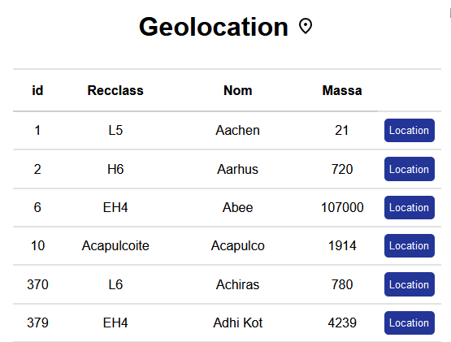
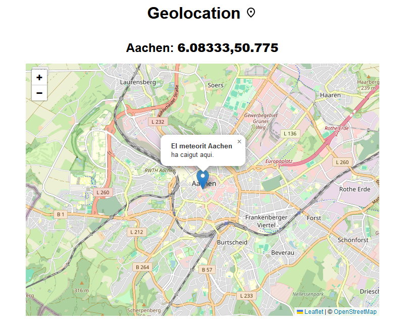

# M6-UF2. Activitat optativa: Geolocalització amb Leaflet

## Enunciat

Donada la llista de
meteorits i la seva geolocalització, fes que cada fila de meteorit tingui un botó i que al polsar-lo es vegui
en un mapa la seva ubicació.
Utilitza per fer-lo la lliberia leaflet amb els seus exemples, i mostra un marker al punt on ha caigut el
meteorit.

### Resultat: 
